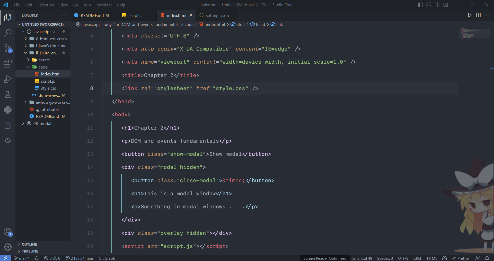

# My Vscode Settings and Extensions

## Extensions

-  [Auto Close Tag](https://marketplace.visualstudio.com/items?itemName=formulahendry.auto-close-tag): Automatically add HTML/XML close tag, same as Visual Studio IDE or Sublime Text

-  [Auto Rename Tag](https://marketplace.visualstudio.com/items?itemName=formulahendry.auto-rename-tag): Automatically rename paired HTML/XML tag, same as Visual Studio IDE does

-  [background](https://marketplace.visualstudio.com/items?itemName=shalldie.background): Bring background to your vscode

-  [Code Runner](https://marketplace.visualstudio.com/items?itemName=formulahendry.code-runner): Run C, C++, Java, JavaScript, PHP, Python, Perl, Ruby, Go, Lua, Groovy, PowerShell, ect...

-  [CodeSnap](https://marketplace.visualstudio.com/items?itemName=adpyke.codesnap): Take beautiful code screenshots from within VS Code

-  [Color Highlight](https://marketplace.visualstudio.com/items?itemName=naumovs.color-highlight): Highlight web colors in your editor

-  [CSS Peek](https://marketplace.visualstudio.com/items?itemName=pranaygp.vscode-css-peek): Allow peeking to css ID and class strings as definitions from HTML files to their coresponding CSS rules

-  [Eassy Terminal Zoom](https://marketplace.visualstudio.com/items?itemName=kishannareshpal.easy-terminal-zoom): Easy Terminal Zoom

-  [EditorConfig for VS Code](https://marketplace.visualstudio.com/items?itemName=EditorConfig.EditorConfig): EditorConfig Support for Visual Studio Code

-  [Error Gutters](https://marketplace.visualstudio.com/items?itemName=IgorSbitnev.error-gutters): Show error gutters to the right from line numbers

-  [Error Lens](https://marketplace.visualstudio.com/items?itemName=usernamehw.errorlens): Improve highlighting of errors, warnings and other language diagnostics.

-  [ESLint](https://marketplace.visualstudio.com/items?itemName=dbaeumer.vscode-eslint): Integrates ESLint JavaScript into VS Code.

-  [FontSize Shortcuts](https://marketplace.visualstudio.com/items?itemName=fosshaas.fontsize-shortcuts): Change the font size with keyboard shortcuts

-  [GitHub Copilot](https://marketplace.visualstudio.com/items?itemName=GitHub.copilot): AI-powered code completion and I love it so much

-  [Highlight Matching Tag](https://marketplace.visualstudio.com/items?itemName=vincaslt.highlight-matching-tag): Highlight matching html tag

-  [indent-rainbow](https://marketplace.visualstudio.com/items?itemName=oderwat.indent-rainbow): Makes indentation easier to read

-  [Markdown All in One](https://marketplace.visualstudio.com/items?itemName=yzhang.markdown-all-in-one): All you need to write Markdown (keyboard shortcuts, table of contents, auto preview and more)

-  [Markdown Preview Enhanced](https://marketplace.visualstudio.com/items?itemName=shd101wyy.markdown-preview-enhanced): Markdown Preview Enhanced with better image previews and mermaid+flowchart+mathjax support

-  [Prettier](https://marketplace.visualstudio.com/items?itemName=esbenp.prettier-vscode): Code formatter using prettier

-  [Rainbow CSV](https://marketplace.visualstudio.com/items?itemName=mechatroner.rainbow-csv): Colorize your CSV files

-  [Rainbow Tags](https://marketplace.visualstudio.com/items?itemName=voldemortensen.rainbow-tags): A rainbow brackets extension for VS Code

-  [Subtle Match Brackets](https://marketplace.visualstudio.com/items?itemName=rafamel.subtle-brackets): Underlined matching brackets and more

-  [Word Count](https://marketplace.visualstudio.com/items?itemName=ms-vscode.wordcount): Markdown Word Count Example - a status bar contribution that reports out the number of works in a Markdown document as you interact with it.

## Setting

You can find it in [here](assets/setting.json)

## Theme

- [Theme](https://marketplace.visualstudio.com/items?itemName=tal7aouy.theme)
- [Material Icon Theme](https://marketplace.visualstudio.com/items?itemName=PKief.material-icon-theme)

### Font
- SF Mono Ligatures
- Fira Code Ligatures
- Operator Mono Ligatures
- JetBrains Mono Ligatures

## Screenshot

